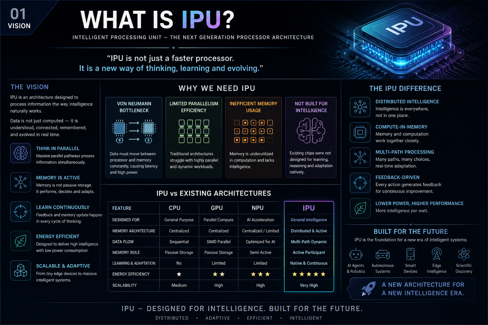
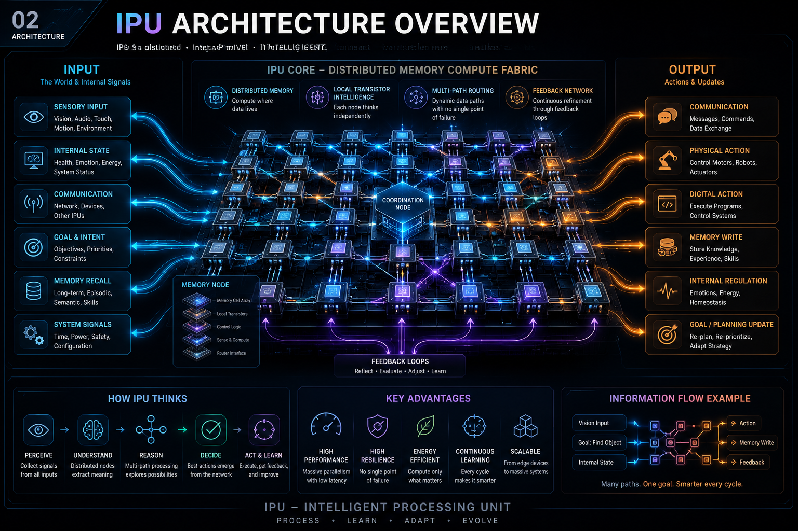

# Intelligent Processing Unit (IPU)

IPU Architecture – Focus on interface, not implementation.

## 📄 Documentation
- [Read the full IPU Whitepaper (PDF)](docs/IPU-Architecture.pdf)

## 🧩 Overview
The Intelligent Processing Unit (IPU) is an architectural framework for intelligent systems.  
It defines **responsibilities, interfaces, and cooperation** between components, not specific algorithms or hardware.

### Key Principles
- Focus on **interface, not implementation**
- Modular & open by design
- Technology agnostic
- Continuous learning & feedback-driven

### Core Components
- Input System  
- Conversational Engine  
- Memory System  
- Goal Manager  
- Planning & Reasoning  
- Internal State  
- Action System  
- Feedback Network  

## 🖼️ Images
All diagrams are stored in the [images](docs/images/) folder.  
Example illustrations:

## ⚡ License
This project is released under the [MIT License](LICENSE).
## 🤝 Contribute
Contributions are welcome!  
- Fork this repository  
- Create a new branch for your changes  
- Commit improvements (docs, diagrams, prototypes)  
- Submit a Pull Request  

Please keep contributions aligned with the IPU philosophy:  
**Focus on interface, not implementation.**

## 🚀 Future Work
This project is an architectural foundation.  
Planned directions include:
- Expanding documentation with more diagrams and examples  
- Building prototype modules (Conversational Engine, Memory, Planning)  
- Testing with different hardware/software stacks  
- Exploring community-driven extensions and research papers  

The goal is to evolve IPU as an **open framework** for intelligent systems.

